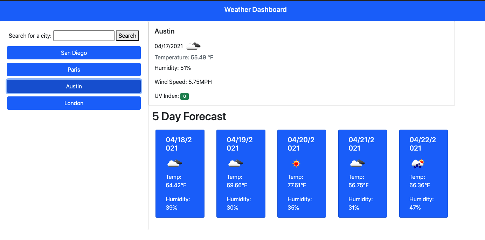
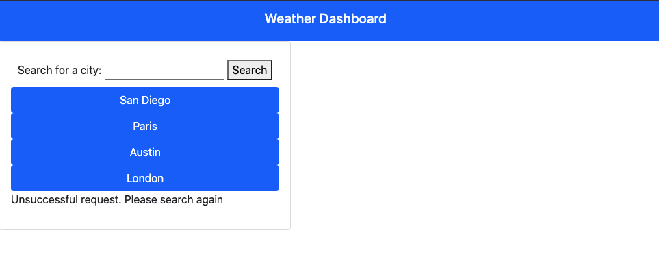

# Weather Dashboard App

URL: https://cristina-gorrino.github.io/weather-dashboard-app/

Purpose: To create a weather dashboard app that allows users to rearch for a city and get a weather forecast.

## Description

This weather dashboard provides the user an easy place to search for current and upcoming weather information for cities of interest. The application uses the Open Weather Map - One Call API to request the relevant data, first finding the latitude and longitude of the requested city, then using the position data to make a second API call for the weather data. They can search for a city in the search form, and then a dashboard with current weather data, and a five day forecast for the requested city is displayed. It includes info on temperature, humidity, a weather icon, and a UV index indicator that changes color depending on whether the UVI is favorable, moderate, or severe.

When the user searches for a city that data is saved in local storage, and can be accessed again by clicking on the buttons on the dashboard that display cities that have been previously searched by the user.

## Visuals

Below are some examples of the look and functionality of this app

